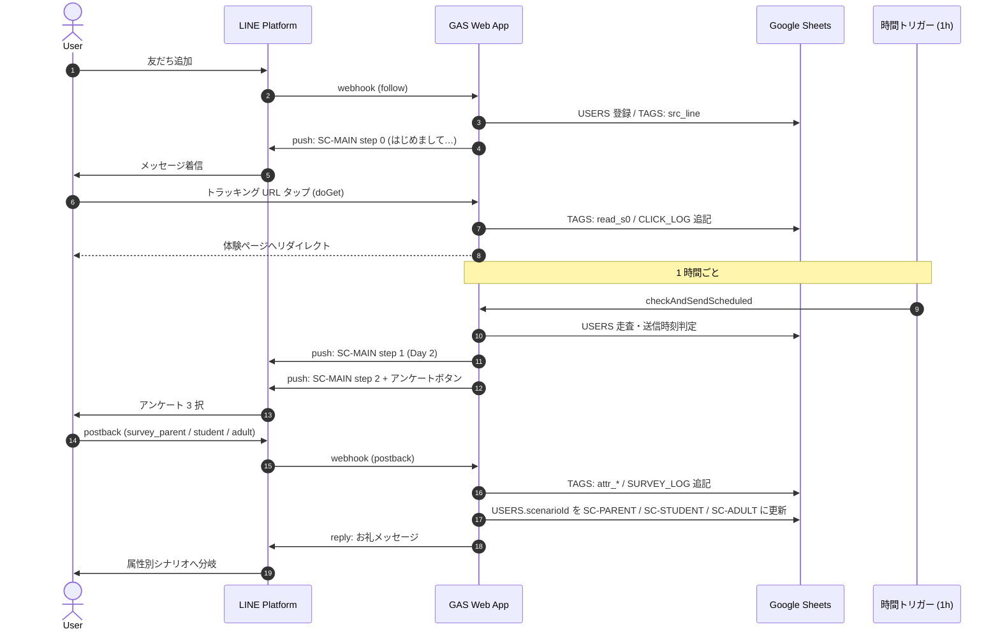

# sho eigo LINE Bot

sho eigo の見込み顧客育成を自動化する LINE Bot です。Google Apps Script (GAS) と Google Sheets、LINE Messaging API のみで構成された ProLine 代替の軽量実装で、友だち追加から属性アンケート、長期休眠ユーザーへのリエンゲージ、そして自動登録解除までを一つのスクリプト (`line_bot.js`) でカバーします。配信スケジュールやシナリオ分岐は Google Sheets を DB として保持し、1 時間おきの時間トリガーで進行します。

## アーキテクチャ

- **GAS Web App** — `doPost` が LINE Webhook (follow / message / postback) を受け取り、`doGet` がトラッキング用クリックリダイレクト（タグ付与 + クリックログ）を担当します。
- **Google Sheets を DB として利用** — `USERS` / `TAGS` / `CLICK_LOG` / `SURVEY_LOG` / `DELETION_LOG` の各シートにユーザー状態・タグ・行動ログを保存します。
- **1 時間ごとの時間トリガー** — `checkAndSendScheduled` を毎時実行し、各ユーザーの現在ステップから配信タイミング (`delayDays` + `sendHour`) を判定して push 配信、休眠判定 (`checkEngagement`)、削除判定 (`checkDeletionEligibility`) を行います。
- **シナリオ定義はコード内 `SCENARIOS_DATA`** — ステップごとに `delayDays` / `sendHour` / `trackingTag` / `sendSurvey` / `sendQuiz` / `skipIfTag` / `executeDeletion` を持ち、属性に応じてシナリオを切り替えます。



## 初期セットアップ

1. **LINE Developers でチャネル作成** — Messaging API チャネルを作成し、Channel access token (long-lived) を発行する。
2. **Google Sheets を新規作成** — URL から spreadsheet ID（`/d/XXXX/edit` の `XXXX` 部分）を控える。
3. **GAS プロジェクトを新規作成** — `line_bot.js` の中身をコードファイルに、`appsscript.json` をマニフェストファイルにそれぞれ貼り付ける（マニフェストファイルが見えない場合はエディタの「プロジェクトの設定 → "appsscript.json" マニフェスト ファイルをエディタで表示する」を ON）。
4. **`CONFIG` を編集** — `LINE_TOKEN` と `SS_ID` を実値に差し替える。`GAS_URL` はこの時点では空（プレースホルダのまま）で OK。
5. **デプロイ** — 「デプロイ → 新しいデプロイ → ウェブアプリ」で **次のユーザーとして実行: 自分**, **アクセスできるユーザー: 全員** を選択し、発行された Web app URL を `CONFIG.GAS_URL` に貼り戻して再デプロイ。
6. **`setupSheets()` を一度だけ実行** — エディタ上部の関数ドロップダウンから `setupSheets` を選んで実行し、4 シート（USERS / TAGS / CLICK_LOG / SURVEY_LOG）を初期化する。
7. **`setupTrigger()` を一度だけ実行** — 同じ手順で `setupTrigger` を実行し、`checkAndSendScheduled` の毎時トリガーを登録する。
8. **LINE 側に Webhook URL を登録** — LINE Developers Console で Webhook URL に GAS Web app URL を貼り、「Webhook の利用」を ON にする。
9. **応答メッセージを無効化** — LINE Official Account Manager の応答設定で「応答メッセージ」を OFF にする（Webhook と二重配信されるため）。

## シナリオ一覧

| scenarioId | 対象 | ステップ数 | 入口 | 出口 |
| --- | --- | --- | --- | --- |
| `SC-MAIN` | 友だち追加直後の全ユーザー | 4 (step 0–3) | `follow` イベント | step 2 のアンケート回答で属性別シナリオへ / クイズ正解で step 3 へ |
| `SC-PARENT` | 保護者属性 | 2 (step 0–1) | `survey_parent` postback | 配信完了後はそのまま停止 |
| `SC-STUDENT` | 中高生（英検志向）属性 | 2 (step 0–1) | `survey_student` postback | 配信完了後はそのまま停止 |
| `SC-ADULT` | 大人（実用英語）属性 | 2 (step 0–1) | `survey_adult` postback | 配信完了後はそのまま停止 |
| `SC-DORMANT` | 30 日以上 read_* タグなしの休眠ユーザー | 2 (step 0–1) + クイズ | `checkEngagement` で自動移行 | クイズ postback で `SC-MAIN` step 3 に復帰 / 反応なしなら `SC-DELETE-NOTICE` |
| `SC-DELETE-NOTICE` | 60 日以上反応なし（dormant 化から 30 日経過） | 4 (step 0–3) | `checkDeletionEligibility` で自動移行 | step 3 で `executeUserDeletion` 実行（`deleted` タグ付与 + DELETION_LOG 記録）/ 途中で `reactivated` が付けば全 step `skipIfTag` で停止 |

## シート構造

### USERS

| 列 | 意味 |
| --- | --- |
| `userId` | LINE userId（主キー） |
| `displayName` | LINE プロフィール表示名（取得失敗時は「さん」） |
| `scenarioId` | 現在のシナリオ ID（`SC-MAIN` 等） |
| `stepNumber` | 次に送るステップ番号（送信のたびに +1） |
| `stepSentAt` | 直近のステップ送信時刻（`isSendDue` の基準） |
| `registeredAt` | 友だち追加（登録）時刻 |

### TAGS

| 列 | 意味 |
| --- | --- |
| `userId` | LINE userId |
| `tag` | タグ名（`src_line`, `read_s0`, `attr_parent`, `dormant`, `low_engagement`, `reactivated`, `purchased`, `deleted` ほか） |
| `addedAt` | タグ付与時刻（休眠開始時刻 = `dormant` タグの `addedAt`） |

### CLICK_LOG

| 列 | 意味 |
| --- | --- |
| `userId` | クリックしたユーザーの LINE userId |
| `tag` | 紐づく tracking tag（例: `read_s0`） |
| `url` | リダイレクト先の元 URL |
| `clickedAt` | クリック時刻 |

### SURVEY_LOG

| 列 | 意味 |
| --- | --- |
| `userId` | 回答ユーザーの LINE userId |
| `answer` | postback data（`survey_parent` / `survey_student` / `survey_adult`） |
| `scenarioMoved` | 移動先シナリオ ID |
| `answeredAt` | 回答時刻 |

### DELETION_LOG

| 列 | 意味 |
| --- | --- |
| `userId` | 削除対象ユーザーの LINE userId |
| `deletedAt` | `executeUserDeletion` 実行時刻 |
| `reason` | 削除理由（自動削除は `auto_inactivity_60d`） |

## デバッグ用関数

GAS エディタ上部の関数ドロップダウンから直接呼び出すか、テスト用ラッパー関数を別途定義して引数を渡してください（GAS エディタは引数付き関数の直接実行ができないため、ラッパーを作るのが手軽です）。

- **`sendStepNow(userId, scenarioId, stepNum)`** — 指定ユーザーに任意シナリオの任意ステップを即時 push 配信し、`USERS.stepNumber` を次に進めます。アンケートやクイズステップであればボタンも続けて送ります。
- **`monitorAdvanceNextStep(userId)`** — 指定ユーザーの USERS 行を読み、現在の `scenarioId` / `stepNumber` をそのまま `sendStepNow` に渡して即時配信します。配信タイミングを待たずに次の一手を試したいときに便利です。
- **`sendTestDeletionNotice(userId)`** — `SC-DELETE-NOTICE` の全 4 step のうちメッセージのある 3 通を `[テスト配信]` プレフィックス付きで連続 push します。USERS の状態は変更しません。

ラッパー例（コードに追記して関数ドロップダウンから実行）。

```javascript
function _debug_sendStepNow()        { sendStepNow('Uxxxxxxxxxxxxxxxx', 'SC-MAIN', 0); }
function _debug_advanceNext()        { monitorAdvanceNextStep('Uxxxxxxxxxxxxxxxx'); }
function _debug_testDeletionNotice() { sendTestDeletionNotice('Uxxxxxxxxxxxxxxxx'); }
```

## 本番投入前チェックリスト

- [ ] CONFIG 3 値が実値
- [ ] setupSheets() 実行済み（4 シート存在）
- [ ] setupTrigger() 実行済み（毎時トリガー存在）
- [ ] LINE Webhook URL 登録済み
- [ ] 友だち追加 → SC-MAIN step 0 が即着信
- [ ] URL タップ → TAGS に read_s0、CLICK_LOG に1行追加
- [ ] アンケート3択 → 属性別シナリオへ移動 + reply 着信
- [ ] 24時間後に SC-MAIN step 1 が自動配信
- [ ] 30日 read_* なし → SC-DORMANT 自動移行
- [ ] 60日無反応 → SC-DELETE-NOTICE 自動移行
- [ ] reactivation（メッセージ送信 or postback）で deletion sequence 解除
- [ ] ブロック→再フォローで step 巻き戻りが起きない

## ライセンス

Private / Internal — sho eigo 内部利用専用。再配布・社外公開は不可。
